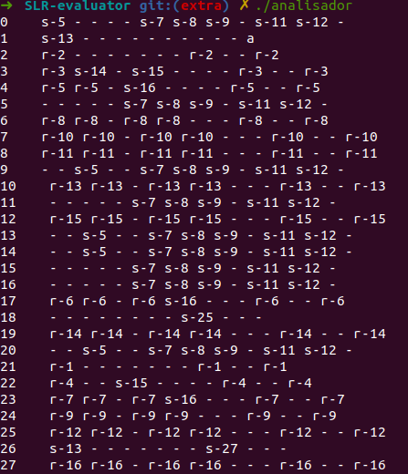

# Trabalho prático 2 - Compiladores

#### Grupo: 

- Lucas Caetano Lopes Rodrigues / 2016006670
- Lucas Starling De Paula Salles / 2016006697

# Introdução

A tarefa proposta foi a implementação de um analisador sintático de expressoões matemáticas para um conjunto de convenções lexicas e uma gramática definidos. A gramática conta com operadores lógicos, de adição, multiplicação, parêntesis, sinais, constantes, variavéis e funções. O objetivo era gerar um codigo interativo, capaz de receber do usuario uma expressão, ou lista de expressões, para avaliação. O programa deve pedir para o usuario inserir o valor para variaveis, no momento de sua avaliação, caso existam. Por fim o avaliador deve resolver as expressões, em ordem entrada caso sua sintaxe esteja correta, e informar o resultado para o usuario. Uma expressão com sintaxe invalida deve exibir um erro e interromper a execução de programa, assim que o erro for verificado.

O primeiro passo para desenvolver o analisador foi o tratamento da gramática. Esse processo foi feito manualmente, e para tal foi nescessario entendê-la. Percebemos que a definição para os sinais da gramática existiam como uma convenção léxica além de uma regra da gramática, por isso escolhemos tratá-los como símbolos léxicos, ou seja, sinais foram usados como um símbolo terminal. Além disso, alteramos as produções `function_ref := identifier` e `function_ref := identifier ( expr_list )`  para que a gramática consiga diferenciar entre identificadores (equivalentes a variáveis no programa) de identificadores de funções matemáticas (`sin`, `cos`, `log`). Tendo isso definido, seguimos para a expansão da gramática seguida pelo cálculo do fechamento.

### A Gramática: 
    G' := expr_list
    expr_list := expr_list , expr
    expr_list := expr
    expr := simple_expr
    expr := simple_expr RELOP simple_expr
    simple_expr := term
    simple_expr := sign term
    simple_expr := simple_expr ADDOP term
    term := factor
    term := term MULOP factor
    factor := identifier
    factor := constant
    factor := ( expr )
    factor := function_ref
    factor := NOT factor
    function_ref := func_identifier
    function_ref := func_identifier ( expr_list )

 ### Closure:


# Desenvolvimento

Para desenvolver o projeto com o funcionamento correto, implementamos não apenas do analisador sintático mas também de um léxico. O analisador léxico é responsável pela tokenização da entrada do usuário e o encaminhamento dos tokens gerados para a análise sintática. O projeto foi desenvolvido completamente em C++.


## Analisador Léxico

O Analisador léxico é o primeiro componente do compilador. Sua função é receber as expressões inseridas pelo usuário e separá-la em _tokens_ de acordo com os símbolos da gramática, para, então, enviar o conjunto de _tokens_ ao analisador sintático.

Durante a leitura da expressão inserida pelo usuário (ou conjunto de expressões separadas por vírgula), foram utilizadas expressões regulares para reconhecimento de _tokens_ e símbolos terminais da gramática, assim como destacar as operações (ADDOP, RELOP, MULOP) e caracteres especiais (e.g., parêntesis). As seguintes expressões regulares foram utilizadas:

 

Após a leitura dos caracteres e separação dos _tokens_, o analisador léxico invoca o método `parse()`  do analisador sintático, que é explicado na seção seguinte, enviando-lhe o vetor criado.

## Analisador Sintático

A análise sintática de gramáticas SLR é feita usando a tecnica de `shift reduce` e pode ser entendida como uma máquina de estados. Sua função de transição representa as possíveis transformações descritas pela gramática. Essa função transforma o estado atual em um próximo estado determinado pelo símbolo mais recente vindo de uma pilha que os armazena em ordem de entrada. A função transição é derivada da gramática e definida por um conjunto de regras de transição e um estado final, representando a aceitação sintática da expressão avaliada.

O algotitmo de análise foi implementado conforme o exemplo provido:


Assim sendo a implementação contou com: uma pilha de estado, uma pilha de símbolos e duas tabelas, `Action` e `Goto`. O _parser_ recebe como entrada os _tokens_ do analisador léxico. As tabelas foram modeladas como uma classe:

    class SLR_Table {
        public:
            SLR_Table();
            void printAction();
            void printGoto();
            std::tuple<char, int> get_action(int, int);
            int get_go_to(int, int);
        private:
            std::string action[STATES][TERMINALS];
            int go_to[STATES][NON_TERMINALS];
            std::string composeAction(int, bool );
            void assembleAction();
            void assembleGoto();
    }

Essas tabelas foram preenchidas usando o conjuto de fechamento de forma a compor de forma correta a tabela SLR(1) para a gramática. As figuras a seguir foram geradas pelo programa para verificação do formato das tabelas:

A ordem das colunas (implementada no código) é a seguinte: 

- Tabela Action:

`, | RELOP | sign | ADDOP | MULOP | identifier | constant | ( | ) | NOT | func_identifier | $`

- Tabela GOTO:

`E' | expr_list | expr | simple_expr | term | factor | function_ref` 

|                  Tabela Action                  |             Tabela GOTO              |
| :---------------------------------------------: | :----------------------------------: |
|  |  |

<br>


Esse objeto, `SLR_Table`, conta com os métodos responsaveis pela codificação e decodificação das ações esperadas para cada transição de estados válida: `composeAction()` e `get_action()`, respectivamente. Ambas recebem o estado atual e símbolo atual como entrada. A notação usada armazenou _shifts_ para um estado `x` como `s-x` e _reduces_ usando a regra gramátical `g` como `r-g`. Além disso, o método `get_go_to()` também recebe o estado atual e o símbolo de entrada e retorna o próximo estado da máquina. O valor `-1` foi utilizado como código de erro na Tabela GOTO e o valor `-`  foi utilizado como código de erro na Tabela Action. Por fim `printAction()` e `printGoto()` imprimem as respectivas tabelas, seus resultados podem ser observados acima.

O algoritmo de análise sintática foi implementato também com o auxílio de uma classe:


    class SLR_Parser {
        SLR_Table *table;
        std::vector<int> state_stack;
        std::vector<int> symbol_stack;
        public:
            SLR_Parser();
            bool parse(std::vector<int>);
        private:
            bool reduce(int); 
            void parse_action(std::string);
            void clean_parser();
    }


Um objeto `SLR_Parser` conta com uma tabela `SLR_Table`, uma pilha de estados `state_stack` e uma pilha de símbolos percorridos, `symbol_stack`. O método `clean_parser()` esvazia essas pilhas e `reduce()` é um auxiliar que recebe o número da regra gramatical e realiza a redução corretamente. Por fim, `parse()` implementa o algoritmo mencionado, seu retorno indica se a expressão está sintaticamente correta.


    bool SLR_Parser::parse(std::vector<int> expression){
        char type;
        int cur_state, new_state, symbol;
    
        int position = 0;
        symbol = expression[position];
        expression.push_back(EOE);
    
        bool is_valid = true;
        bool parsing = true;
    
        while(parsing){
            cur_state = this->state_stack.back();
            if (DEBBUGER) {
                std::cout << cur_state << "," << symbol << ": ";
            }
            std::tuple<char, int> action = 
                this->table->get_action(cur_state, symbol);
    
            type = std::get<0>(action); //Type of action to be executed
            new_state = std::get<1>(action); //State or rule
    
            if (DEBBUGER) {
                std::cout << type << "-" << new_state << std::endl;
            }
    
            if( type == 's'){ //Shift
                this->state_stack.push_back(new_state);
                this->symbol_stack.push_back(symbol);
                position++; 
                symbol = expression[position];
    
            } else if( type == 'r'){ //Reduce
                this->reduce(new_state);
                new_state = this->table->get_go_to(this->state_stack.back(),
                    this->symbol_stack.back());
                if(new_state == GOTO_ERROR){
                    is_valid = false;
                    parsing = false;
                }
                this->state_stack.push_back(new_state);
    
            } else if(type == ACTION_ERROR){
    
                is_valid = false;
                parsing = false; 
    
            } else if(type == ACTION_ACC){
                parsing = false; 
            }else{
                is_valid = false;
                parsing = false; 
            }        
        }
        this->clean_parser();
        return is_valid;
    }


# Operação

- Compilação: Feita através de linha de comando. No diretório do projeto basta executar `make` no terminal. O executável `analisador` será gerado na raiz do projeto. O comando `make clean` também foi implementado para remover os objetos gerados durante a compilação e o executável.


- Execução: Também por linha de comando, no diretorio executar `./analisador`.


- Uso: O terminal que roda o programa espera uma expressão do usuário, se houverem variáveis seus valores serão pedidos ao usuario quando forem avaliados. Se a expressão estiver correta o resultado, ou resultados, são expostos na tela e o usuario poderá realizar o input novamente. Caso contário o programa exibirá uma mensagem de erro e terminará sua execução.


# Testes

As figuras a seguir mostram os testes realizados com o _parser_.


## Listagem dos programas

A estrutura do diretório do projeto é a seguinte:

```
.
├── analisador
├── doc
│   ├── Doc.md
│   └── Trabalho_Pratico_2_Compiladores_1.pdf
├── images
├── lib
│   ├── grammar-constants.hpp
│   └── SLR-parser.hpp
├── makefile
├── obj
│   ├── grammar-constants.o
│   ├── main.o
│   └── SLR-parser.o
├── README.md
├── src
│   ├── analisador-lexico.cpp
│   ├── grammar-constants.cpp
│   ├── main.cpp
│   ├── parser.cpp
│   └── SLR-parser.cpp
└── testes.txt
```

